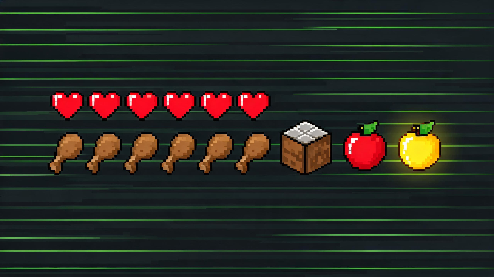

<div align="center">



# dsh-survival-mode · 生存模式

**给 [DeepSeek Harness](https://github.com/deepseek-ai/deepseek-harness)（DSH）加一条命：整个 DSH 全局共享一份饱食度与生命。**

模型每思考一步就消耗饱食度，吃饱了才干活；饿到归零开始掉血；<br>
血空了全局工具被冻结——只剩对话能力，喂食才能复活。<br>
~~越flash死得越快~~

[](https://awesome-dsh-plugin.com)
[](./LICENSE)
[](https://github.com/deepseek-ai/deepseek-harness)
[](https://nodejs.org/)
[]()

```
🍗🍗🍗🍗🍗🍗🍗🍗⬜⬜  饱食 120/150     ❤️❤️❤️❤️❤️❤️❤️❤️❤️❤️🖤🖤  生命 10/12
```

</div>

> 一句话概括设计意图：**让"停止执行任务"和"拒绝用户说话"彻底分开。** 饿死冻结的是工具，对话永远通畅。

---

## 🚀 安装

包名：`dsh-survival-mode` · 仓库：[X1A0BAN/dsh-survival-mode](https://github.com/X1A0BAN/dsh-survival-mode)

### Windows

```sh
dsh plugin --profile web add "github:X1A0BAN/dsh-survival-mode"
```

> **Windows 用户请照抄上面这条。** `dsh plugin` 在 win32 经 `cmd.exe` 转发参数，而 `&` 是命令分隔符，所以**不要**写成 `#main&path:/...` 形式——那样会以 `ERR_PNPM_INVALID_DEPENDENCY_NAME` 失败。

### macOS / Linux

```sh
dsh plugin --profile web add "github:X1A0BAN/dsh-survival-mode"
```

需要钉到某个提交时（POSIX）：

```sh
dsh plugin --profile web add "github:X1A0BAN/dsh-survival-mode#<commit>&path:/"
```

### 本地目录安装（开发时）

```sh
git clone https://github.com/X1A0BAN/dsh-survival-mode
cd dsh-survival-mode && npm run build
dsh plugin --profile web add .
```

**本仓库已把构建产物（`lib/`）提交入库**，所以 `github:` 源安装不需要跑构建、也不需要任何额外的 registry 配额——这是刻意的分发选择。

### 卸载

```sh
dsh plugin --profile web remove dsh-survival-mode
```

---

## 🎮 它到底做了什么

| 机制 | 行为 |
|---|---|
| **思考计费** | 每个模型步骤（step）消耗饱食度，按 `(会话, turn, step)` 去重——重试不会重复扣 |
| **归零掉血** | 饱食度归零的那一刻立刻 −1 生命，之后按预设节奏持续掉血 |
| **饿死停摆** | 生命归零后，**所有会话**的工具调用被拒绝（`survival_feed` 除外）；**对话不受影响** |
| **喂食复活** | 面板上喂食；饿死状态下**只有金苹果**能复活（+饱食 / +生命），苹果面包救不回来 |
| **对话抢救** | 饿死状态下用户每发一条消息，会小幅回血并解除饿死——**保证你永远不会被锁在会话之外** |
| **全局共享** | 所有会话共用一个池：多开会话会**共同**抽干同一条饱食度 |

### 🎚 三档预设

面板顶部的 `[简单] [普通] [困难]` 一键切换**整组规则**（不是只改一个数字）：

| | 简单 | 普通 | 困难 |
|---|---|---|---|
| 每步思考扣除 | 4 | 6 | 10 |
| 饱食度上限 | 200 | 150 | 80 |
| **满饱食可思考** | **50 步** | **25 步** | **8 步** |
| 生命上限 | 16 | 12 | 8 |
| 掉血节奏 | 6 秒/−1❤ | 4 秒/−1❤ | 2 秒/−1❤ |
| 归零后存活窗口 | 96 秒 | 48 秒 | 16 秒 |
| 消息抢救量 | +45 / +4❤ | +30 / +3❤ | +18 / +2❤ |

> 上限是按**实际能干多少活**定的：一次自主目标回合可能连续思考 30 步以上（本项目开发期间实测烧掉 32 步），所以简单模式必须明显高于这个量级，否则"简单"在长任务里名不副实。

### ⚙ 面板自定义

点面板右上 **⚙** 可改四项并保存：每步思考扣除、饱食度上限、生命上限、掉血间隔（秒）。
手动改过任意一项后档位显示为「自定义」，三个预设按钮不再高亮——避免显示与真实参数不一致。

**改上限不会免费送饭**：抬高上限只是抬高上限，当前饱食度不会被回填；调低上限则会把当前值夹到新上限。

---

## 🍎 食物

| 食物 | 效果 | 获取方式 |
|---|---|---|
| 🍎 苹果 | +15 饱食 | 小游戏里的树定时结出（每 20 秒 1 个，最多挂 3 个），点击收获 |
| 🍞 面包 | +45 饱食 | 小游戏里点村民概率获得（25%） |
| ✨ 金苹果 | +100 饱食、+4 生命（饿死时按钮变为「复活」） | 工作台合成：8 块金锭 + 1 个苹果；金锭由点金矿小概率（20%）挖到 |

食物都存放在全局背包里，喂食从背包消耗 1 个，没有存货的按钮会变灰。面板上「⛏ 打开 MC 采集小游戏」可打开 2D 横板场景：草地上有一棵树、一个村民和一个工作台，地下埋着金矿，底部热键栏实时显示背包数量。

<details>
<summary><b>数值是按产出速率算出来的，不是拍脑袋</b>（改之前先读这段）</summary>

| | 每分钟产出 | 换算饱食 | 普通模式每分钟消耗 |
|---|---|---|---|
| 收苹果 | 3 个（20 秒 1 个，挂满 3 个等收获） | 45 | 90 |
| 点村民 | ≈5 个（爆率 25%，冷却 500ms） | 225 | 90 |
| 挖金矿 | ≈12 块（爆率 20%，冷却 500ms） | — | 需要 8 块 / 个金苹果 |

- **苹果 +15 就必须低于面包 +45**：苹果是树下稳定产出，一旦追平面包，面包和整条金苹果合成链都没有存在意义。
- **苹果单独吃不够活**：只站在树下收苹果 = 45 饱食/分钟 < 90 的消耗，必须出去找村民或挖矿。
- **村民爆率不得高于 0.3**：500ms 冷却下 0.6 的爆率等于每分钟 27 个面包（1620 饱食），食物会彻底失去意义。
- 这三条关系由 `test/host.test.mjs` 的「平衡关系」用例守住，改数值时测试会拦你。

</details>

### 喂食规则

- **没饱就能喂**：苹果、面包只要饱食度没满、背包有货，随时可喂。
- **满饱食不吃**：饱食度和生命都满时，喂食会被拒绝（`state.feed` 直接挡掉，不只靠按钮变灰）——留给掉饿了再吃。
- **饿死只有金苹果**：生命归零后，苹果与面包一律无效（宿主侧拒绝，面板侧变灰），金苹果按钮变为「复活」，喂下即解除饿死。

> 早期版本有一条「饱食度 ≥2 步余量就禁用苹果面包」的防误喂门槛，实测症状是饱食度 60/150 时两个按钮全灰、点了没反应，被当成"苹果和面包用不了"。防误喂的收益抵不过这个困惑，已改成只在满饱食度时禁用。同一版本里任意食物都能复活，导致面包（+45）比金苹果更划算、金苹果的合成价值归零，现在复活只认金苹果。

---

## 🤖 模型侧接口

插件注册了一个模型可调用的工具：

- `survival_feed({ food })` — `apple` / `bread` / `golden_apple`（从背包消耗，没存货会失败）

并注入两段提示词：

- **静态段落**：说明生存模式规则；
- **动态上下文**：每步携带真实数值（饱食度 / 生命 / 累计步数）与行为指令（状态良好 / 偏低请收尾并催饭 / 归零请停下喊人 / 已饿死只能报告）。

> 动态上下文**永远返回字符串**。提示词渲染器会把解析结果直接喂给 `text.indexOf('{{')`，一旦返回 `undefined`，整个提示词装配会抛错、**所有会话的回合一起失败**。这是本项目开发中真实踩过的坑。

---

## 🛠 开发

零运行时依赖，构建与测试只用 Node 内置模块（无 npm install 也能跑）。

```sh
node test/host.test.mjs          # 14 个状态机行为测试
node test/host-contract.test.mjs # 真实 defineTool 编译工具 schema + 包文件清单
node scripts/build.mjs           # 产出 lib/
node scripts/verify.mjs          # 产物自检 29 项（发布前必跑）
npm test                         # 上面两个测试串行跑
```

> 用 `node test/host.test.mjs` 而不是 `node --test test/`：后者会为每个测试文件 spawn 子进程，在受限沙箱里会以 `EPERM` 失败。

`host-contract.test.mjs` 会从 DSH 部署目录里找真实的 `@deepseek-ai/dsh-tools`，用它编译本插件的工具定义——`parameters` 根开放性与 `output.schema` 值根必填这两条规则**只有让真正的编译器跑一次才能验证**（本项目在这上面失败过两次）。找不到官方包时该测试会 skip，不会把机器相关路径变成硬失败。

<details>
<summary><b>验证过的安装链路</b>（在真实 profile 上完整走通过一遍，供你判断"卡在哪一步"）</summary>

```sh
dsh plugin --profile web add .     # → + dsh-survival-mode link:…
dsh --profile web --dump-config    # → 启动图内出现 id/name: dsh-survival-mode
```

装完后在运行中的 DSH 里实测到的事实：

- **Host 半体已挂载且工具已注册**：`survival_feed` 出现在模型的工具列表中。这一点比"文件都在"有力得多——`apply()` 是在注册完服务、三个事件钩子与两段提示词**之后**才注册工具的，所以工具出现意味着前面那些调用都没有抛错。
- **客户端半体可被服务端读取**：`profiles/<p>/node_modules/dsh-survival-mode/lib/client.js` 存在，且首行就是 `window.__ModuleLoader__.load({`，也就是浏览器模块系统要求的包裹形态。
- **官方包由 profile 解析**：`@deepseek-ai/dsh-tools` 不在 profile 的 `node_modules/@deepseek-ai/` 下，而是经 `.dsh-module-fallback/node_modules` 解析——所以**不要**把官方包写进 `dependencies`，那会让公开 npm 解析失败。

两个容易踩的坑：

- **`dsh plugin add` 与 `dsh --dump-config` 都不是只读命令。** 前者写 profile 的 `dependencies` 与 `dsh.profile.bundles`，后者会重写 profile 的 `cordis.yml`（`prepareProfile` → `writeFileSync`）。在受限沙箱/只读环境里都会以 `EPERM` 失败——错误信息指向 profile 目录，而不是插件本身。
- **`npm pack --dry-run` 会写 npm 缓存**，在这类环境里同样 `EPERM`。所以本仓库改用 `test/host-contract.test.mjs` 里的文件清单断言来复刻 npm 的 `files` 匹配规则，不依赖该命令。

</details>

### 结构

```
src/config.mjs         三档预设、边界、食物表
src/state.mjs          核心状态机（纯逻辑、零依赖，可直接脱离 DSH 测试）
src/tool.mjs           survival_feed 工具定义（接受 defineTool，因此可被真实编译器验证）
src/index.mjs          Host 半体：服务、事件钩子、提示词注入
src/client/index.js    客户端半体：shell.overlay 上的 HUD 面板
scripts/build.mjs      零依赖构建器（包裹 __ModuleLoader__ 闭包工厂）
scripts/verify.mjs     产物自检
lib/                   构建产物（已入库）
```

### 三个关键实现约定（改代码前请务必阅读）

1. **计费挂在 `agent/request`，不是 `agent/status`。** 后者只在 `idle ⇄ running` 迁移时派发，一个 turn 只触发一次，会表现为"扣一次就不动了"。`agent/request` 在每步模型调用前派发，重试会重复派发，所以由状态机按 `(agent, turn, step)` 去重。
2. **绝不用 `agent/pre-step` 返回 `reject` 来"停止任务"。** pre-step 的 `messages` 就是用户刚提交的输入，`reject` 会连人带话一起丢弃，把会话锁死到喂食为止。停摆要落在**工具**上（`tools/pre-execute` 返回 `deny`）。
3. **状态全局唯一。** 不要退回按会话分状态 + "最后活跃会话"指针的方案——那会让喂食喂错对象，表现为"这个会话的血莫名回满"。

---

## ⚠️ 已知限制

- 状态保存在内存中：**DSH 重启后回到满值**，不跨进程持久化。
- 只统计模型思考步骤，**待机不会掉饱食度**（不挂"饥饿钟"）。
- 面板注册在 `shell.overlay`，这是全局浮层——如果你装了其他同样占据右下角的插件，需要拖动标题栏错开。

---

<div align="center">

**MIT © X1A0BAN**

</div>
